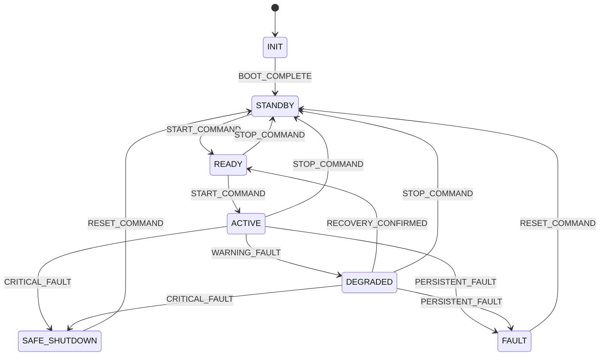

# OpsSight
[](https://opssight-agwkrtnxc3jk4i2hfq4pok.streamlit.app)

OpsSight는 다중 신호 기반 이상 징후를 단순 탐지 결과로 끝내지 않고, **경보 수준(Alert Level)**, **상태 전이(State Transition)**, **추천 조치(Recommended Action)**, **시나리오 기반 검증(Scenario Validation)** 으로 연결하는 **운용지원 응용SW 프로토타입**입니다.


이 프로젝트는 다양한 입력 신호에서 발생하는 이상 징후를 운용자가 바로 해석할 수 있는 상태 정보로 변환하고, 치명 상황에서는 안전 정지와 고장 상태를 구분하며, 복구 및 수동 reset까지 포함한 운용 흐름을 검증할 수 있도록 설계되었습니다.
핵심 목표는 단순히 이상을 탐지하는 것이 아니라, **이상 징후를 실제 운용 판단과 시험 가능한 구조로 연결하는 것**입니다.

---

## 프로젝트 개요

실제 운용 환경에서는 단순히 "이상이 있다"는 정보만으로 충분하지 않습니다.  
더 중요한 것은 다음입니다.

- 현재 시스템이 어떤 상태인지
- 경보가 어느 수준인지
- 즉시 어떤 조치를 취해야 하는지
- 동일한 상황을 다시 재현하고 검증할 수 있는지

OpsSight는 이 문제를 해결하기 위해 다음 구조를 중심으로 설계되었습니다.

- **Alert Engine**: 이상 징후를 `INFO`, `CAUTION`, `WARNING`, `CRITICAL`로 해석
- **State Machine**: 경보 수준에 따라 `ACTIVE`, `DEGRADED`, `SAFE_SHUTDOWN`, `FAULT` 등 상태 전이
- **Runtime Controller**: 탐지 결과를 상태 판단 및 조치 흐름으로 연결
- **Scenario Validation Pipeline**: 기대 상태와 실제 결과를 비교해 PASS/FAIL 검증
- **Fault Tracker**: 일시적 이상과 지속적 고장을 구분하기 위한 경보 지속 시간 추적

즉, OpsSight는 탐지 모델 자체보다 **운용 가능성, 설명 가능성, 검증 가능성**에 더 초점을 둔 구조입니다.

---

## 이렇게 설계한 이유

OpsSight는 단순히 이상 탐지 모델을 구현하는 프로젝트로 끝내고 싶지 않았습니다.  
운용 소프트웨어 관점에서는 다음이 더 중요하다고 판단했습니다.

- 결과를 사람이 바로 활용할 수 있어야 함
- 상태 전이가 명확해야 함
- 예외 상황과 복구 흐름이 정의되어 있어야 함
- 동일한 상황을 재현하고 검증할 수 있어야 함

그래서 모델 성능 비교보다, **상태 전이, 경보 해석, 시나리오 실행, 검증 가능성**을 중심으로 구조를 확장했습니다.

---

## 설계 목표

### 1. 탐지 결과는 조치로 이어져야 한다
이상 탐지 결과를 단순 점수로만 보여주는 것이 아니라, 경보 수준과 추천 조치로 연결해야 한다고 판단했습니다.

### 2. 점수보다 상태가 중요하다
운용자는 개별 모델 점수보다 현재 시스템이 `ACTIVE`, `DEGRADED`, `SAFE_SHUTDOWN`, `FAULT` 중 어떤 상태인지 빠르게 파악해야 합니다.

### 3. 검증 가능한 구조여야 한다
운용 소프트웨어는 단순히 "잘 동작한다"가 아니라, 정상/경고/치명/복구 상황을 시나리오로 정의하고 기대 결과와 실제 결과를 비교할 수 있어야 합니다.

### 4. 일시적 이상과 지속적 고장은 구분해야 한다
단일 시점 이상만으로는 transient abnormality와 persistent fault를 구분하기 어렵다고 판단해, 경보 지속 시간을 추적하는 fault tracker를 추가했습니다.

---

## 시스템 구조

OpsSight는 아래 흐름으로 동작합니다.

```
Input Signals
   ↓
Detection / Risk Scoring
   ↓
Alert Engine
   ↓
Fault Tracker
   ↓
Runtime Controller
   ↓
State Machine
   ↓
Operator Guidance / Dashboard
   ↓
Scenario Validation (Loader → Executor → Validator)
```

### 핵심 구성 요소

#### 1. Detection
다중 신호 입력에서 이상 징후를 탐지합니다.

#### 2. Alert Engine
탐지 결과와 위험도를 바탕으로 아래 경보 수준으로 분류합니다.

| 레벨 | 설명 |
|------|------|
| `INFO` | 정상 범위 |
| `CAUTION` | 경미한 이상 징후 |
| `WARNING` | 운용 저하 수준 |
| `CRITICAL` | 즉각 조치 필요 |

#### 3. Fault Tracker
경고와 치명 경보의 지속 시간을 추적해 다음을 구분합니다.

- 일시적 이상 (transient)
- 지속적 경고 (persistent warning)
- 지속적 치명 이상 (persistent critical)

#### 4. State Machine
경보 수준과 fault 조건에 따라 시스템 상태를 전이합니다.

| 상태 | 설명 |
|------|------|
| `INIT` | 초기화 중 |
| `STANDBY` | 대기 상태 |
| `READY` | 운용 가능 |
| `ACTIVE` | 정상 운용 중 |
| `DEGRADED` | 제한 운용 (경고 수준 이상) |
| `SAFE_SHUTDOWN` | 안전 정지 (치명 이상) |
| `FAULT` | 고장 잠금 (지속/복합 이상) |

#### 5. Runtime Controller
Alert Engine 결과를 State Machine 이벤트로 변환하여, 현재 상태·마지막 이벤트·추천 조치를 일관된 흐름으로 연결합니다.

#### 6. Scenario Validation Pipeline
JSON 기반 시나리오를 실행하고, 기대 상태와 실제 결과를 비교해 PASS/FAIL을 판정합니다.

#### 7. Dashboard
상태 카드, 경보 정보, 서브시스템 상태, 시나리오 검증 결과를 시각적으로 확인할 수 있습니다.

---

## 상태 전이 설계

OpsSight는 이상 징후를 단순 score로만 처리하지 않고, 경보 수준에 따라 시스템 상태가 전이되도록 설계했습니다.  
경미한 이상은 `DEGRADED`, 치명적 이상은 `SAFE_SHUTDOWN`, 지속적 이상은 `FAULT`로 연결되며, 복구가 확인되면 `READY`, 수동 reset이 수행되면 `STANDBY`로 복귀합니다.



### Alert → State 연결표

| 조건 | Trigger Event | 다음 상태 |
|------|---------------|-----------|
| 정상 모니터링 | 없음 | 현재 상태 유지 |
| 경고 수준 이상 | `WARNING_FAULT` | `DEGRADED` |
| 치명 수준 이상 | `CRITICAL_FAULT` | `SAFE_SHUTDOWN` |
| 지속적 치명 이상 | `PERSISTENT_FAULT` | `FAULT` |
| 복구 확인 | `RECOVERY_CONFIRMED` | `READY` |
| 수동 reset | `RESET_COMMAND` | `STANDBY` |

---

## Fault Persistence Tracking

단일 시점 이상 여부만으로는 일시적 이상과 지속적 고장을 구분하기 어렵다고 판단해, OpsSight에는 Fault Tracker를 추가했습니다.

Fault Tracker는 아래 항목을 추적합니다.

- `warning_streak`: 연속 경고 횟수
- `critical_streak`: 연속 치명 경보 횟수
- `normal_streak`: 연속 정상 횟수
- `persistent_critical`: 지속적 치명 이상 여부

이를 통해 다음과 같은 판단이 가능해집니다.

- 한 번의 `CRITICAL` 경보는 치명 경보로 처리
- 연속된 `CRITICAL` 경보는 지속적 치명 이상으로 간주
- 지속적 critical 상태일 때만 `PERSISTENT_FAULT`로 승격
- `INFO` 또는 `CAUTION` 상태가 지속되면 recovery 흐름 판단 가능

즉, OpsSight는 **일시적 이상과 지속적 고장을 같은 수준으로 다루지 않도록 설계**되었습니다.

---

## 시나리오 기반 검증

OpsSight는 정상, 경고, 치명, 복구, 수동 reset 등의 상황을 JSON 시나리오로 정의하고, 이를 실행한 뒤 기대 상태와 실제 결과를 비교해 PASS/FAIL을 판정합니다.

### 검증 파이프라인

1. **Scenario Loader**: 시나리오 파일을 로드합니다.
2. **Scenario Executor**: 초기 액션과 이벤트를 순차적으로 실행합니다.
3. **Validator**: 아래 항목을 비교합니다.
   - expected final state vs actual final state
   - expected alert level vs actual alert level

### 지원 이벤트 유형

OpsSight 시나리오는 두 종류의 이벤트를 처리할 수 있습니다.

- `inputs`: anomaly score, risk score, fault condition 등 입력 기반 이벤트
- `action`: reset, stop, activate 등 운용 명령 이벤트

즉, 단순 입력 주입뿐 아니라 **운용 명령까지 포함한 시험 시나리오**를 구성할 수 있습니다.

---

## 시나리오 커버리지

현재 검증 완료된 시나리오는 다음과 같습니다.

| Scenario | Expected Final State | Expected Alert | 목적 |
|----------|---------------------|----------------|------|
| `normal_startup` | `ACTIVE` | `INFO` | 정상 기동 검증 |
| `low_level_caution` | `ACTIVE` | `CAUTION` | 경미한 이상 신호 검증 |
| `warning_comm_delay` | `DEGRADED` | `WARNING` | 경고 수준 운용 저하 검증 |
| `critical_safe_shutdown` | `SAFE_SHUTDOWN` | `CRITICAL` | 치명 상황 안전 정지 검증 |
| `critical_compound_fault` | `FAULT` | `CRITICAL` | 지속/복합 이상에 의한 고장 잠금 검증 |
| `recovery_after_reset` | `READY` | `INFO` | 복구 확인 후 정상 복귀 검증 |
| `multiple_warning_then_recovery` | `READY` | `INFO` | 반복 경고 후 복구 검증 |
| `warning_to_critical_escalation` | `SAFE_SHUTDOWN` | `CRITICAL` | 단계적 악화 흐름 검증 |
| `sensor_stuck_warning` | `SAFE_SHUTDOWN` | `CRITICAL` | 센서 고착 기반 치명 상황 검증 |
| `manual_reset_after_fault` | `STANDBY` | `INFO` | fault 이후 수동 reset 복귀 검증 |

### 검증 가능한 흐름

- 정상 기동
- 경미한 이상
- 경고 상태 진입
- 치명 상황에서의 안전 정지
- 지속/복합 이상에서의 고장 잠금
- 복구 확인에 의한 상태 복귀
- 수동 reset에 의한 대기 상태 복귀
- 경고 → 치명 단계적 악화

---

## 대시보드 기능

OpsSight 대시보드는 분석 결과를 단순 시각화하는 데서 그치지 않고, **운용 판단과 검증 구조를 중심**으로 재구성되어 있습니다.

### 주요 UI 요소

- Current State
- Alert Level
- Last Event
- Recommended Action
- Subsystem Operational Status
- Scenario Validation (PASS/FAIL)
- Operator Guidance Report
- Operation Log
- Runtime Decision Details (reasons, state transition history, fault persistence tracking)

### 대시보드 탭 구성

1. System Status Monitoring
2. Scenario Validation
3. Alert Overview
4. Operator Guidance Report
5. Operation Log
6. Scenario Stream Simulator
7. Signal Impact Analysis

---

## 폴더 구조

```
OpsSight/
├── data/
│   └── raw/
├── docs/
├── scenarios/
│   ├── critical_compound_fault.json
│   ├── critical_safe_shutdown.json
│   ├── low_level_caution.json
│   ├── manual_reset_after_fault.json
│   ├── multiple_warning_then_recovery.json
│   ├── normal_startup.json
│   ├── recovery_after_reset.json
│   ├── sensor_stuck_warning.json
│   ├── warning_comm_delay.json
│   └── warning_to_critical_escalation.json
├── src/
│   ├── agents/
│   │   └── pipeline.py
│   ├── analysis/
│   │   ├── feature_importance.py
│   │   └── process_contribution.py
│   ├── core/
│   │   ├── alert_engine.py
│   │   ├── fault_tracker.py
│   │   ├── runtime_controller.py
│   │   └── state_machine.py
│   ├── dashboard/
│   │   └── app.py
│   ├── prediction/
│   │   └── risk_scorer.py
│   ├── preprocessing/
│   │   └── preprocess.py
│   ├── simulator/
│   │   └── stream_simulator.py
│   ├── test_runner/
│   │   ├── scenario_executor.py
│   │   ├── scenario_loader.py
│   │   ├── test_scenario_loader.py
│   │   ├── test_scenario_validation.py
│   │   └── validator.py
│   └── process_map.py
├── README.md
└── requirements.txt
```

---

## 핵심 모듈 설명

| 모듈 | 역할 |
|------|------|
| `src/core/state_machine.py` | 운용 상태 전이 로직 |
| `src/core/alert_engine.py` | 이상 징후를 INFO/CAUTION/WARNING/CRITICAL로 변환 |
| `src/core/fault_tracker.py` | 경보 지속 시간 추적, transient/persistent 구분 |
| `src/core/runtime_controller.py` | alert engine과 state machine 연결, 상태/이벤트/조치 반환 |
| `src/test_runner/scenario_loader.py` | JSON 시나리오 로드 |
| `src/test_runner/scenario_executor.py` | 시나리오 실행, step별 결과 생성 |
| `src/test_runner/validator.py` | 기대 상태와 실제 결과 비교, PASS/FAIL 판정 |
| `src/dashboard/app.py` | 운용 상태, 경보, 시나리오 검증 결과 시각화 |

---

## 한계점

OpsSight에는 다음 한계가 있습니다.

1. **공개 데이터 기반 프로토타입**  
   공개 센서 데이터 기반으로 구현했기 때문에 실제 장비 신호와 차이가 있습니다.

2. **Python 기반 시뮬레이션 환경**  
   Python 기반 시뮬레이션 구조이므로 RTOS 수준의 실시간 제어 소프트웨어와는 차이가 있습니다.

3. **추상화된 서브시스템 표현**  
   실제 장비명 대신 추상화된 서브시스템/신호 단위로 설계했습니다.

하지만 이런 한계에도 불구하고, 이 프로젝트는 **이상 탐지 결과를 운용 상태와 검증 구조로 연결하는 응용SW 설계 관점**을 구체화하는 데 초점을 맞췄습니다.

---

## 실행 방법

### 1. 패키지 설치

```bash
pip install -r requirements.txt
```

### 2. 대시보드 실행

```bash
streamlit run src/dashboard/app.py
```

### 3. 시나리오 검증 테스트 실행

```bash
python -m src.test_runner.test_scenario_validation
```

### 4. Fault persistence tracking 테스트 실행

```bash
python -m src.core.test_fault_tracker_runtime
```

---

## 프로젝트 요약

OpsSight는 다중 신호 기반 이상 징후를 다음 흐름으로 연결하는 운용지원 응용SW입니다.

**Detection → Alert Scoring → Fault Persistence Tracking → State Transition → Scenario Validation → Operator Guidance**

단순한 anomaly detection 데모가 아니라, **상태 기반 판단과 시험 가능한 구조를 갖춘 운용지원 소프트웨어 프로토타입**입니다.
